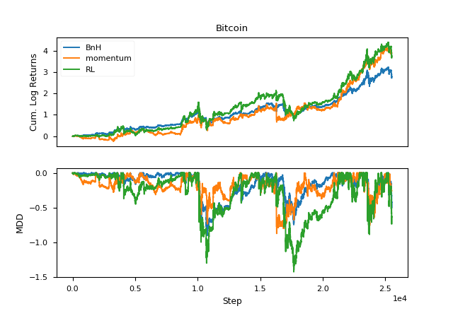

# Trading Bitcoin with Reinforcement Learning

This [post](https://launchpad.ai/blog/trading-bitcoin) describes how to apply reinforcement learning algorithm to trade Bitcoin. While implementation details are given in the post, no code was provided from the author. So I decide give it a try and reproduce the result myself. I will briefly explain my implementation as well as some differences from the original method presented in the post.



Dependecies:

- Numpy 1.13.3
- Pandas 0.19.2
- Matplotlib 2.0.0 (for plotting only)
- TALib 0.4.0 (to compute technical indicators described in the post)
- PyTorch 0.3.1


## How to run

1. Download data following instructions from the **Data** section.

2. Run the following command to create dataset:

   ```markdown
   python resample.py
   ```

3. Run the following command to train the agent:

   ```markdown
   python main.py
   ```


## Data

Bitcoin data is publically accessible from [Kaggle](https://www.kaggle.com/mczielinski/bitcoin-historical-data/data), although you do need an account to download them. We will use the data in the "coinbaseUSD_1-min_data_2014-12-01_to_2018-03-27.csv" file that you can choose on the left panel. Download the file to the same directory which you clone the repo to and run `resample.py`. This will give you the file `BTCUSD-15Min-Data.pkl` which we will use to train our agent. The pickle file contains a dictionary with two keys: *data* and *label*. The value for both keys are a pandas dataframe. The first one holds all the 21 features as input to the agent, while the second one holds the OHLCV data we will later use to compute the reward function.


## Environment

I find directly training with dataloaders in PyTorch like we usually do in supervised learning to be difficult. Hence I implement a simple [OpenAI Gym](https://gym.openai.com/)-like environment class interface where you can find similar methods such as *reset* and *step*. How it works is quite straightforward: it takes in a pandas dataframe and loop over each row to provide state information and reward feedback to the agent at each time step. This is contained in the `env.py` file. Other details about the environment setup is basically the same as described in the post.


## Agent

Since the policy gradient algorithm REINFORCE is used in the post, the agent class is a parametrized neural network policy. The network is build using PyTorch (my favourite deep learning library, BTW). Parameter initialization is done as described in the post but the weight for output layer is *zeroed*. The is equivalent to initializing a *uniformly random* policy which gives us maximal exploration at the early stage of training. The agent class is contained in `agent.py`.


## Training

This part of the program is contained in `main.py`. We split the data 70%, 30% as training and testing set. Each episode contain 96 consective steps. It turns out we don't need 3 million episodes of training as the author stated in the post, 5000 episodes of training are sufficient to yield good results. I guess it's because Bitcoin roughly stays in the up trend during the session covered in both training and testing set. A more standard forward-walk optimization can be employed if you want to cover ranges like the early 2018 where Bitcoin drops sharply from its peak.